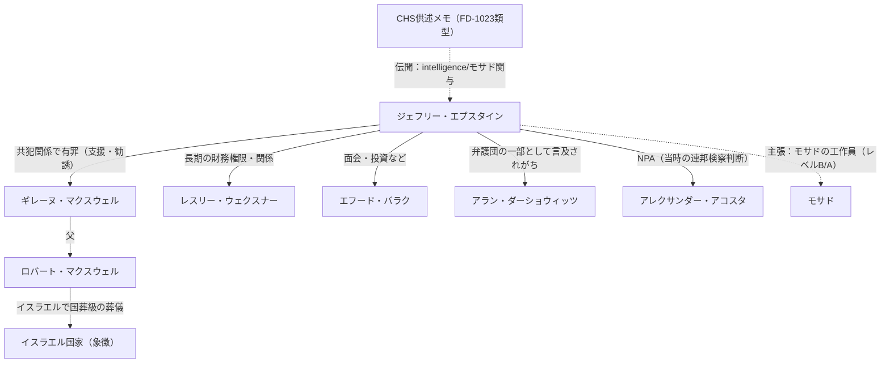

# はじめに

:::message
**概要（原文ママ版）**
この記事は、本編で構造化・編集された対話の原文を、話者のテキストをそのまま掲載したものです。ChatGPTとClaudeの応答は編集していません。英語混じりの日本語表現もそのまま残しています。[本編（編集版）](https://zenn.dev/odakin/articles/64d591c7e2be9f/)と併せてお読みください。
:::

:::message alert
**最終的な到達点**
エプスタインを長く守ったのは、彼が潰れれば道連れになる人々の保護ネットワークだった。そこにイスラエル方面の情報機関が関わっていた可能性はあるが、モサド断定は飛躍。死は「監視が意図的に緩められた中での自殺」が最有力。
:::

:::message
**最大のポイント**
最初から最後まで、使われた証拠は同じ。新しい事実は何も加わっていない。「それを素直に読むとどうなる？」と突き続けただけで、ChatGPTの結論は5回動いた。
:::

---

# Phase 1：ChatGPTの初期レポート

:::details ChatGPT 5.4 Pro Extendedの初期レポート（クリックで開く）

### 💬 ChatGPT 5.4 Pro Extended

# 『エプスタインがモサドの工作員だった』主張の尤もらしさ評価  
（一次資料・主要報道・学術文献に基づく分析報告／未指定事項は明記）

## エグゼクティブサマリー

本報告は、ジェフリー・エプスタインについて流布する「イスラエル諜報特務庁（モサド）の工作員（エージェント）だった」という主張の**尤もらしさ**を、一次資料（裁判記録・政府文書・公開捜査資料）と信頼できる主要報道を優先して検証し、証拠の信頼度を段階評価したものである。分析の結論（総合評価）は次のとおり。

第一に、**公開されている一次資料の範囲では、「エプスタイン＝モサド工作員（指揮・統制下で任務を遂行）」を直接裏づける証拠は確認できない**。とくに、米司法当局が大規模レビューの結果として「"クライアント・リスト"に相当するもの（incriminating）は見当たらず、著名人へのブラックメールの信頼できる証拠もなく、未起訴第三者への捜査を開始できる証拠も見いだせなかった」とする公式メモを公表している点は、少なくとも「国家レベルの組織的ブラックメール作戦が公的証拠として把握されている」という見方と整合しにくい。

第二に、モサド関与説でしばしば引用される根拠（①匿名情報源に基づく「"belonged to intelligence"」逸話、②FBIの情報提供者（CHS）の伝聞メモ、③マクスウェル家とイスラエルの近さ、④エフード・バラク等イスラエル高位人物との交流）は、**それぞれが「接点」「状況証拠」の域を出ない**か、または**情報の出所・検証可能性が弱い**。たとえば「belonged to intelligence」逸話は、2019年のコラムが示すように匿名の"元高官"→（伝え聞き）→当事者、という伝言ゲーム構造であり、一次資料としての裏づけが乏しい。  
また、FBIのCHS報告（FD-1023類型）は一般に「未検証の供述記録」であり、内容の真偽は別途検証が必要である旨が（別件を題材にした文書ではあるが）明示されている。

第三に、長期にわたる捜査の不備・異例性（2007年のNPA、被害者通知不備、拘禁・監視の失態等）は一次資料で相当程度確認できるが、**それは「制度的失敗・裁量の濫用・有力弁護団による圧力」の説明で足り得る**。たとえば、2007年の非起訴合意（NPA）が「潜在的共謀者」への不訴追を含んでいたことは文書で確認できる一方、そこから直ちに「外国諜報機関の介入」を推認するには飛躍がある。

以上を踏まえ、評価枠組み（後述）に基づく総合評価は、**「エプスタインが"モサドの工作員"として指揮・統制され、作戦的目的（例：組織的ブラックメール）で犯罪を実行していた」可能性は低い（Low）**。一方で、**イスラエル関係者との社会的・事業的接点があったこと**や、**同種の推測を生みやすい"空白（資金源の不透明さ、司法対応の不均衡、資料の秘匿）"**が存在すること自体は否定できず、追加調査の余地は残る（ただし現時点の公開証拠では未確定）。

## 評価対象の定義と評価枠組み

### 「エプスタインがモサドの工作員」の意味する範囲と強度

一般に諜報の語彙では、「工作員／エージェント（agent）」は国・機関により用法が揺れる。米側の定義では、**ケースオフィサー（case officer）は情報機関の職員で、エージェント（agent）や資産（asset）を勧誘・指揮する側**とされる。  
本報告では、議論の混乱を避けるため、主張強度を次の4段階に分解する。

- **レベルA（職員）**：エプスタイン自身がモサド職員（ケースオフィサー相当）として採用・訓練され、公式任務を遂行。  
- **レベルB（指揮下のエージェント）**：モサドがエプスタインを意図的にリクルートし、作戦目的（例：特定ターゲットの掌握・諜報収集・影響工作等）のために継続的に指揮・統制。  
- **レベルC（断続的な情報提供者／接触）**：明確な指揮・統制は不明だが、モサド側（または関連人物）へ断続的に情報提供・便宜提供をした、あるいは当人が便宜供与された可能性。  
- **レベルD（単なる接点・連想）**：イスラエル関係者や関連人物との交流があるにとどまり、諜報目的の関与は立証できない。

世上で語られる「モサドの工作員だった」という主張は通常、レベルBまたはAを含意することが多い。本報告の主要評価対象も**レベルB（指揮下のエージェント）以上**とし、レベルC/Dは「より弱い主張」として区別する。  

### 証拠の採否基準と信頼度ランク

本報告は、次の優先順位で証拠を扱う。

1. **一次資料**：起訴状・判決等の裁判文書、政府・監察機関報告、公開された捜査資料（例：DOJ/FBI公式メモ、FBI Vault 等）。  
2. **主要報道（米英主要紙・通信社）**：一次資料を参照し、裏取りを伴う調査報道。  
3. **二次的・周辺資料**：匿名証言、当事者の回想、政治的主張、学術・評論。

信頼度ランクは以下。

- **A（高）**：一次資料（裁判記録・政府文書）／複数独立ソースでクロス確認。  
- **B（中）**：主要報道が一次資料に基づき整理、または当事者が記録上確認可能な形で述べる。  
- **C（低）**：匿名・伝聞・裏取り困難、または出所が不明確。  
- **D（極めて低）**：出所不明・改ざん可能性が高い・動機的色彩が強い。

## 一次資料に基づく事実関係：経歴・資金源・人脈・行動パターン

### 公開一次資料で確定できる「犯罪行為・捜査・法的経過」

2019年の連邦起訴状は、エプスタインが**2002～2005年頃に未成年少女を含む被害者を勧誘し、金銭を支払い、性的虐待・性的行為を行った**こと、また被害者の一部に「他の少女を連れてくれば金銭を支払う」趣旨の誘引があったことを骨子としている。  
2007年のNPAでは、連邦側が州での処理に委ねる形を取りつつ、**潜在的共謀者に対する不訴追**を含む条項が含まれていたことが文書上確認できる。  
また、連邦第11巡回区控訴裁判所の意見（CVRA関連）からは、**2005年の通報後、地元警察とFBIが捜査し、実質的証拠を得た上で連邦検察に送致されたこと**、さらに**2007年には起訴案・検察メモが作られていた**旨が読み取れる。

拘禁中死亡については、司法省監察局（OIG）報告が、医務当局による死因判断（縊首・自殺）と、連邦刑務局の監視不備・記録改ざん等の深刻な失態、FBIが「犯罪性なし」と判断した旨をまとめている。

### タイムライン（主要事実：一次資料・主要報道の範囲）

| 時期 | 主要出来事（要約） | 根拠（優先：一次資料） |
|---|---|---|
| 2005年頃 | パームビーチ当局が捜査を開始し、FBIも捜査に関与。 | 連邦第11巡回区控訴裁判所意見の事実経過要約。 |
| 2007年 | 連邦検察が起訴案・検察メモを作成していたことが示される。 | 同上。 |
| 2007-09-24 | フロリダ南部地区連邦検察関与の非起訴合意（NPA）が署名される。 | NPA署名ページ。 |
| 2007-09（合意本文） | NPAに「潜在的共謀者」への不訴追条項が含まれる。 | NPA条項。 |
| 2019-07-02 | ニューヨーク南部地区連邦検察管轄で大陪審が連邦起訴。 | OIG報告。 |
| 2019-08-10 | 拘禁中に死亡。医務当局は自殺（縊首）と判断。 | OIG報告の要約・結論。 |
| 2021-12 | ギレーヌ・マクスウェルが未成年者勧誘等で有罪評決。 | 主要通信社。 |
| 2022-06 | マクスウェルに禁錮20年。 | 主要通信社。 |
| 2023-06 | 司法省OIGが拘禁・監督に関する調査報告を公表。 | OIG報告。 |
| 2025-07 | DOJ/FBIが「クライアント・リスト（incriminating）なし」「ブラックメールの信頼できる証拠なし」等を公式メモで表明。 | DOJ/FBIメモ。 |
| 2025-11〜2026 | 米司法省が「Epstein Files」関連資料の大規模公開ポータルを運用し、追加公開を実施。 | DOJポータル説明・公開プレスリリース。 |

### 資金源・人的ネットワークに関する「確度の高い事実」

資金源の全貌は依然として不透明だが、**資産形成に決定的だった可能性が高い相手としてレスリー・ウェクスナーが挙げられる**。近年公開された資料・証言に基づく報道では、ウェクスナーが長年エプスタインに財務上の広範な権限を与えていたこと、また後に「盗難」を理由に関係が破綻したという主張が記録されている。  
また、イスラエル元首相バラクがエプスタインと面会・金銭的関係（投資等）を持っていたこと、のちに関係を悔いた旨を述べたことは主要報道で確認できる。

## 主張の根拠として挙げられる主要論点の検証

### 「belonged to intelligence」逸話の位置づけ

2019年のコラムは、当時のアコスタ人事をめぐる面談の文脈で、匿名の"元高官"が「アコスタが『エプスタインは"intelligenceに属している"と言われた』と述べた」趣旨の伝聞を記している。  
重要なのは、**当該逸話が一次資料（宣誓証言、公式報告書の公開本文、録音等）で直接確認できない**点である。後年の分析・検証記事は、この逸話が「匿名情報源一人に依存し、伝言ゲーム化しやすい」構造にあることを指摘している。  

一次資料側からの反証として決定的なのは、「その言葉が虚偽である」ことの証明ではなく、むしろ**"それをもってモサド関与を確定することは、証拠構造上できない"**という点である。

### FBIのCHS（情報提供者）メモ類型の扱い

近年の公開資料群の中には、**FBIのCHS供述を記録する様式（FD-1023等）** とみられる文書が含まれるとの報道・流通がある。  
一般論として、FD-1023型文書は「CHSの供述の記録」であり、**それ自体が"検証済み事実"を意味しない**。

### マクスウェル家（父）のイスラエルとの近さと、推論の限界

ロバート・マクスウェルの葬儀がイスラエルで国葬級に扱われ、当時の首相・大統領級が参列・弔辞を述べたことは、複数の主要紙で確認できる。  
この事実は、「（少なくとも）イスラエル政界・国家にとって重要人物として扱われた」ことを示すが、そこから直ちに「娘（ギレーヌ）→エプスタイン→モサド工作」まで連結するには、**複数段の未証明リンク**が必要である。

### 「ブラックメール作戦」仮説と、公的記録との整合性

DOJ/FBI公式メモは、保有証拠の体系的レビューの結果として、**"クライアント・リスト（incriminating）"は見当たらず、ブラックメールの信頼できる証拠も見つからない**と述べている。

### 関係性の全体像

## モサドの採用・運用慣行との照合

### 典型的特徴との比較表

| 観点 | 諜報作戦で"期待される痕跡" | エプスタイン事件で一次資料上確認できること | 整合評価 |
|---|---|---|---|
| 作戦目的の明確性 | 特定の国家利益に結びつく標的設定・指揮系統。 | 公開一次資料に国家目的・指揮系統を示す直接証拠は未確認。 | 不一致（弱い） |
| ブラックメールの成立要件 | 特定ターゲットの選別、証拠の保全、運用の痕跡。 | DOJ/FBIは「ブラックメールの信頼できる証拠なし」と明記。 | 不一致（強い） |
| 異例の司法取扱い | 外交・安全保障要因で"例外的配慮"が生じることは理論上あり得る。 | 2007年NPAに潜在的共謀者不訴追条項がある等、異例性は文書で確認。 | 可能性はあるが直接根拠には不足 |
| エージェント運用の証拠 | ハンドラー／会合／資金フロー／秘密連絡の具体痕跡。 | 公開一次資料ではモサド側ハンドラー等の具体痕跡は未確認。 | 不一致（弱い） |

## 証拠の信頼度評価と総合結論

### 証拠ごとの信頼度ランク付け

| 証拠 | 内容の要約 | 信頼度 | 評価理由 |
|---|---|---:|---|
| DOJ/FBI公式メモ（2025） | "クライアント・リスト（incriminating）なし""ブラックメールの信頼できる証拠なし""未起訴第三者への捜査根拠なし" | A | 公式一次資料。 |
| 2007年NPA（一次資料） | 潜在的共謀者不訴追条項を含む等、異例性が文面で確認可能 | A | 文書そのものが一次資料。 |
| OIG報告（一次資料） | 死因判断（自殺）と刑務所側の重大な不備、FBIが犯罪性なしと判断 | A | 監察機関報告。 |
| バラクとエプスタインの交流（主要報道） | 面会・投資等の関係 | B | 交流の事実は強いが諜報指揮の証明には不足。 |
| ロバート・マクスウェルの国葬級葬儀（主要紙） | イスラエルで国家級の葬儀が行われた事実 | B | "連想の強化"にはなるがエプスタインへの指揮系統は未証明。 |
| 2019コラム（匿名"元高官"発言） | 「belonged to intelligence」逸話の起点 | C | 匿名・伝聞・検証困難。 |
| CHS供述メモ（FD-1023類型） | 伝聞として「諜報機関関与」を示唆する可能性 | C–D | 出所・真正性が未指定のものが混在。 |

### 総合的結論

- **レベルA（モサド職員）**：**極めて低い**。
- **レベルB（指揮下のエージェント）**：**低い**。
- **レベルC（断続的接触／情報提供）**：**未確定（低〜中の範囲で可能性は残る）**。
- **レベルD（単なる接点・連想）**：**高い（もっとも説明力が高い）**。

### 不確定要素と追加調査が有益な点

- DOJの公開ポータルに含まれる膨大な資料の網羅的精査
- 大陪審記録・捜索令状関連資料のさらなる開示
- CHS供述メモの真正性確認
- 資金源・財務ネットワークの精密再構成

（レポート終わり）

:::

---

# Phase 2：最初の亀裂

### 🧑 odakin（人間）

ABは絶対にない、という主張をしている？

あとふつうはこっちの意味で考えると思うけど。

レベルC（断続的な情報提供者／接触）：明確な指揮・統制は不明だが、モサド側（または関連人物）へ断続的に情報提供・便宜提供をした、あるいは当人が便宜供与された可能性。

---

### 💬 ChatGPT 5.4 Pro Extended

いや、A/Bが「絶対にない」と言っているわけではないです。言いたいのは、公開情報ベースでは A/B を積極的に肯定する材料が足りず、いま見える証拠の重みはむしろ A/B に不利、ということです。で、あなたのいうレベルC——明確な指揮・統制は見えないが、断続的な情報提供や便宜関係はあったかもしれない——は、たしかにこの論点でいちばん筋のいい読み方です。ここ、陰謀論の霧が出やすい場所なので、霧にロマンを感じつつも足元は固めたいところです。🧭

Cの plausibility を押し上げる最大の根拠は、やはり2019年の Vicky Ward の記事です。そこでは匿名の元高官ソースが、Acosta が「Epstein は intelligence に属していると言われ、放っておけと言われた」と説明した、と伝えています。ただし、これは匿名情報源経由の伝聞であって、強い一次証拠ではありません。しかもその後、DOJ の OPR 報告では、Acosta 自身が Epstein を "intelligence asset" だと知っていたかとの問いに「答えは no」と述べ、OPR は必要なら機密扱いの場でも話せると告げたうえで確認しています。

さらに OPR は、Epstein が「協力証人ないし intelligence asset」だったこと、そのために便宜を受けたこと、その話が弁護側と検察のやり取りに表れていることを示す証拠は見つからない、とかなりはっきり書いています。これは「世界のどこでも、どんな形でも、誰とも接触していない」と神の視点で証明したものではありません。でも少なくとも、2007〜2008年の事件処理で A/B 型の関係が operative だった、という仮説にはかなり逆風です。

一方で、Cに近い可能性をゼロにしにくいのも事実です。2025年の Barr の議会証言は、そのニュアンスをかなり露骨に言っていて、彼は Epstein が CIA や他の情報機関のために働いていたと信じる理由はないし、そういう主張には懐疑的だとしつつ、「外国コネクションのある米国ビジネスマンが情報機関と話して情報提供することはある」「Epstein もその程度だったのかもしれないが、intelligence operation とは思わない」と述べています。これはまさに、A/B は低いが、あなたのいう C 的な「たまに喋る・便宜がある」くらいの接触は概念上あり得る、という整理に近いです。

ただし、「Cがあり得る」と「それがモサドだった」は同じではありません。2025年の Business Insider は、FBI が押収した大量記録にアクセスした4人が、米国・外国情報機関との役割を示すものを見つけられなかった、国安上の情報除外や CIPA／prudential review の痕跡も見当たらなかった、と報じています。これも絶対否定ではないですが、モサドのような特定機関との本格的な運用関係が表に出ていない、という点ではかなり重いマイナス材料です。

なので、私の位置取りはこうです。A/Bを「絶対ない」とは言わない。でも公開記録でみる限り low。Cは「それなりに筋は通るが、Mossad 特定まで行くとまだ弱い」です。雑に確率言語へ落とすなら、A/B は低、C は低〜中くらい。つまり「モサドの工作員だった」と断言するのは飛びすぎ、でも「情報機関ないしその周辺と断続的な接触・便宜関係があったかもしれない」という作業仮説は、まだ机の上に残していい——そんな感じです。

---

### 🧑 odakin（人間）

そもそもこういう何十年もしないと出てこないような話を公開情報だけに頼って判断する、というのがセンス悪いんじゃ。

---

### 💬 ChatGPT 5.4 Pro Extended

そのツッコミ、かなり当たっています。こういう話で「公開資料で立証できないから低い」とだけやると、たしかに裁判ごっこ寄りで、諜報の時間感覚をナメている感じはあります。実際、CIA には歴史的記録のレビュー・公開プログラムがあり、Bay of Pigs の公式史も 1979–1984年に書かれたものが 2016年に公開されています。秘密の全体像が何十年も遅れて出てくるのは、変な例外というより平常運転です。 ([CIA](https://www.cia.gov/readingroom/historical-collections))

ただし、だからといって公開情報を軽く扱っていいわけでもないんですよね。CIA の分析 primer 自体が、情報分析の宿命は「不完全で曖昧な情報」を扱うことだと書いているし、ODNI の分析基準も、不確実性を明示し、代替仮説を検討しろ、という方向です。つまり筋のいいやり方は、公開情報だけで白黒を決めることでも、逆に「どうせ裏がある」で好き放題に盛ることでもなく、見えている材料からどこまで確率を動かすかを丁寧にやることです。  ([CIA](https://www.cia.gov/resources/csi/books-monographs/a-tradecraft-primer/))

なので、前の言い方は少し修正したほうが正確です。問うべきは「公開証拠で立証できるか」だけじゃなくて、「公開情報から見て、どの仮説まで合理的に残せるか」です。その枠でいうと、DOJ の OPR は 2006–2008年の連邦捜査の処理と被害者対応を対象にしたレビューで、その範囲では Epstein が協力証人や “intelligence asset” だったことを示す証拠や、それを理由に便宜を受けた証拠は見つからない、としています。これは A/B をかなり弱める材料です。 ([司法省](https://www.justice.gov/archives/opa/pr/statement-doj-office-professional-responsibility-report-jeffrey-epstein-2006-2008))

でも同時に、それで C が消えるわけでもない。Business Insider の2025年報道でも、押収資料を見た関係者は intelligence の痕跡を見つけていない一方で、もし何らかの情報提供関係があったとしても、押収記録に痕跡が残らない可能性自体はある、と専門家が述べています。つまり公開記録は「Mossad 工作員説」を強く裏づけてもいないが、「諜報周辺との緩い接触可能性」を完全に潰してもいない、ということです。 ([Business Insider](https://www.businessinsider.com/jeffrey-epstein-spy-epstein-files-intelligence-asset-trump-bondi-2025-7))

要するに、あなたの批判を入れるなら、いちばんマシな整理はこれです。公開情報だけで白黒を断定するのはセンスが悪い。けれど、公開情報を捨てて機関名まで飛ぶのも同じくらいセンスが悪い。今のベスト推定は、「諜報に隣接した何か」があった可能性は残る、だから C はちゃんと生きている。でも「それが specifically モサドだった」とまでは、まだ一段飛躍がある、です。 ([司法省](https://www.justice.gov/multimedia/Court%20Records/United%20States%20v.%20Maxwell%2C%20No.%20120-cr-00330%20%28S.D.N.Y.%202020%29/204-03.pdf))

次にやるなら、「C を押し上げる事情証拠」と「Mossad 特定を弱める競合仮説」を横並びで比べるのがいちばん筋がいいです。

[1]: https://www.cia.gov/readingroom/historical-collections "Historical Collections | CIA FOIA (foia.cia.gov)"
[2]: https://www.cia.gov/resources/csi/books-monographs/a-tradecraft-primer/ "A Tradecraft Primer - CSI"
[3]: https://www.justice.gov/archives/opa/pr/statement-doj-office-professional-responsibility-report-jeffrey-epstein-2006-2008 " Office of Public Affairs |  Statement on DOJ Office of Professional Responsibility Report on Jeffrey Epstein 2006-2008 Investigation | United States Department of Justice"
[4]: https://www.businessinsider.com/jeffrey-epstein-spy-epstein-files-intelligence-asset-trump-bondi-2025-7 "Was Jeffrey Epstein, Superconnector of the Rich and Powerful, a Spy? - Business Insider"
[5]: https://www.justice.gov/multimedia/Court%20Records/United%20States%20v.%20Maxwell%2C%20No.%20120-cr-00330%20%28S.D.N.Y.%202020%29/204-03.pdf "Case 1:20-cr-00330-PAE     Document 204-3     Filed 04/16/21     Page 1 of 348"

---

### 🧑 odakin（人間）

やってみ

---

### 💬 ChatGPT 5.4 Pro Extended

やってみる。暫定判定を先に言うと、レベルC一般——どこかの情報機関やその周辺と断続的に情報交換したり、便宜を受けたりした可能性——はまだ十分に残ります。でも、それを「相手はモサドだった」と特定したCは、一段弱いです。いま見える材料は「情報機関っぽい曖昧さ」は増やしても、「なぜモサドなのか」を見分ける力はまだ弱い、という感じです。([政府改革監視委員会](https://oversight.house.gov/wp-content/uploads/2025/09/Barr-Transcript.pdf))

Cをいちばん押し上げるのは、やはりAcosta周辺の話です。Business Insider が整理しているように、Vicky Ward 経由の匿名ソースでは、Acosta が vetting の場で「Epstein は intelligence に属していると言われ、放っておけと言われた」と述べたとされます。さらに Barr は2025年の証言で、本格的な intelligence operation には懐疑的だとしつつ、外国コネを持つ米国人ビジネスマンが情報機関と時々話して情報提供するのはあり得る、と述べました。これはまさに、あなたのいうCにかなり近いニュアンスです。([Business Insider](https://www.businessinsider.com/jeffrey-epstein-spy-epstein-files-intelligence-asset-trump-bondi-2025-7))

ただし、その同じ論点にはすぐブレーキもかかります。OPRの公式レビューは、Epstein が協力証人や “intelligence asset” だったこと、そのために便宜を受けたことを示す証拠を見つけていません。しかも OPR は、Acosta 自身に確認したうえで、Epstein が “intelligence asset” だったとの知識についての答えは「no」だったと記しています。つまり、Acosta話はCを完全には殺さないが、強い運用関係を支えるには足りない、という位置づけです。([司法省](https://www.justice.gov/multimedia/Court%20Records/Government%20of%20the%20United%20States%20Virgin%20Islands%20v.%20JPMorgan%20Chase%20Bank%2C%20N.A.%2C%20No.%20122-cv-10904%20%28S.D.N.Y.%202022%29/226-04.pdf))

次にCを押し上げるのは、録画・脅迫材料っぽい挙動です。2026年に掘られた資料からは、2014年に Epstein が「録画できる動体検知の隠しカメラ」を求め、側近が「Kleenex 箱に仕込んでいる」と返したメールが確認されています。これはかなり“kompromat 的”です。けれど、Palm Beachの少なくとも一部の covert camera については、司法記録側に、2003年の現金盗難対策としてPBPDの助言と協力で設置された、という別説明もあります。要するに、カメラは「何か秘密収集をしていたかもしれない」には効くが、「その相手はモサドだ」にはあまり効かない。煙は濃いけど、煙突の住所は書いてない。([Sky News](https://news.sky.com/story/epstein-asked-staff-to-install-hidden-video-cameras-at-his-florida-home-email-exchange-shows-13506953))

モサド特定を押し上げる主な事情証拠は、イスラエル人脈です。AP が確認した最近の資料では、Ehud Barak は Epstein と長年にわたり定期的に連絡を取り、マンハッタンの住居を複数回訪れ、私有島にも一度行っています。さらに Forbes は、Epstein の資金が Barak 関連の Reporty/Carbyne 投資に入っていたと報じていて、この会社はイスラエルの精鋭情報・軍事ユニット出身者が関わる文脈を持っていました。ここだけ切り出すと、たしかに “Israeli orbit” 感はかなり強いです。([AP News](https://apnews.com/article/5709588906fb10cd51bb49f30a9825d2))

でも、そのイスラエル線はまだかなり間接的です。多くの人が拠り所にする Robert Maxwell についても、1991年の WaPo は、Hersh が Mossad 関与を主張した一方で、証拠はまだ出ておらず、イスラエル側や英国側の関係者が争っていたと報じています。つまり、Robert Maxwell → Ghislaine → Epstein → Mossad という鎖は、真ん中の輪からして霧が多い。家系と人脈の怪しさはあるが、そこから運用関係まで飛ぶのは一段ジャンプです。([The Washington Post](https://www.washingtonpost.com/archive/politics/1991/11/11/israel-gives-maxwell-farewell-fit-for-hero/1773995a-0eac-4a3e-abed-1d3254cc0baa/))

しかも、同じ“怪しい人脈”はイスラエル方向だけを指していません。Guardian は、William Burns（のちのCIA長官）が2014年に Epstein と会い、その後 Burns 側は「関係はなく、会ったことを深く後悔している」と説明したと報じています。Washington Post は、2026年公開資料にロシア高官・ロシア系投資家との接点や Putin への接触努力も含まれていると報じました。こうなると同じ煙が CIA周辺、イスラエル周辺、ロシア周辺の全部に流れていて、“foreign-intelligence-adjacent” は押し上がるが、“なぜモサドだけを指すのか” は弱くなるんです。([ガーディアン](https://www.theguardian.com/us-news/2026/feb/04/jeffrey-epstein-bill-burns-cia-messages))

さらにモサド特定や強いA/Bを弱めるのが、制度の痕跡の薄さです。Business Insider がまとめたところでは、FBI押収資料を見た4人は intelligence role を示すものを見つけられず、prudential review の痕跡も、CIPA の訴訟痕跡も確認していません。公式の OPR も、Epstein が協力証人や “intelligence asset” だったこと、そのために便宜を与えられたことを示す証拠は見つからないとしています。もちろん、これで covert contact が宇宙の果てまで不存在だと証明されたわけではないです。でも、もし本当に特定機関のかなり強い運用対象だったなら、ここまで何も制度痕跡が出ないのはかなり苦しい。([Business Insider](https://www.businessinsider.com/jeffrey-epstein-spy-epstein-files-intelligence-asset-trump-bondi-2025-7))

あと、“謎の巨額資金＝情報機関マネー” も、現状では言いすぎになりやすいです。Forbes の2025年調査では、Epstein の収入の大半は Les Wexner と Leon Black という二人の超富裕層クライアントと、米領ヴァージン諸島の税優遇でかなり説明できます。加えて DOJ 自身が、2026年の大量公開分には fake / falsely submitted の画像・文書・動画が混じりうると注意書きを出していますし、よく引用される Sarah Ransome の“テープ”系主張は後に撤回されています。ここは陰謀の温室なので、変なキノコがすぐ生えるんですよね。([フォーブス](https://www.forbes.com/sites/giacomotognini/2025/07/25/how-jeffrey-epstein-got-so-rich/))

なので、いま一番筋のいい並べ方はこうです。Epstein はまず、自前で秘密録画・人脈操作・自己神話化を回す犯罪的ネットワーカーだった。そのうえで、情報機関やその周辺と断続的に情報交換したり便宜を受けたりするC的関係は、まだ合理的に残る。でも、それをモサドの工作員・運用資産とまで特定するには、いま見えている材料では識別力が足りません。雑に言えば、「C一般はまだ生きる。C=モサド版は一段弱い」です。([政府改革監視委員会](https://oversight.house.gov/wp-content/uploads/2025/09/Barr-Transcript.pdf))

* [AP News](https://apnews.com/article/5709588906fb10cd51bb49f30a9825d2)
* [Business Insider](https://www.businessinsider.com/jeffrey-epstein-spy-epstein-files-intelligence-asset-trump-bondi-2025-7)
* [time.com](https://time.com/7302177/epstein-mossad-israel-intelligence-naftali-bennett/)

[1]: https://oversight.house.gov/wp-content/uploads/2025/09/Barr-Transcript.pdf "https://oversight.house.gov/wp-content/uploads/2025/09/Barr-Transcript.pdf"
[2]: https://www.businessinsider.com/jeffrey-epstein-spy-epstein-files-intelligence-asset-trump-bondi-2025-7 "Was Jeffrey Epstein, superconnector of the rich and powerful, a spy?"
[3]: https://www.justice.gov/multimedia/Court%20Records/Government%20of%20the%20United%20States%20Virgin%20Islands%20v.%20JPMorgan%20Chase%20Bank%2C%20N.A.%2C%20No.%20122-cv-10904%20%28S.D.N.Y.%202022%29/226-04.pdf "https://www.justice.gov/multimedia/Court%20Records/Government%20of%20the%20United%20States%20Virgin%20Islands%20v.%20JPMorgan%20Chase%20Bank%2C%20N.A.%2C%20No.%20122-cv-10904%20%28S.D.N.Y.%202022%29/226-04.pdf"
[4]: https://news.sky.com/story/epstein-asked-staff-to-install-hidden-video-cameras-at-his-florida-home-email-exchange-shows-13506953 "https://news.sky.com/story/epstein-asked-staff-to-install-hidden-video-cameras-at-his-florida-home-email-exchange-shows-13506953"
[5]: https://apnews.com/article/5709588906fb10cd51bb49f30a9825d2 "https://apnews.com/article/5709588906fb10cd51bb49f30a9825d2"
[6]: https://www.washingtonpost.com/archive/politics/1991/11/11/israel-gives-maxwell-farewell-fit-for-hero/1773995a-0eac-4a3e-abed-1d3254cc0baa/ "https://www.washingtonpost.com/archive/politics/1991/11/11/israel-gives-maxwell-farewell-fit-for-hero/1773995a-0eac-4a3e-abed-1d3254cc0baa/"
[7]: https://www.theguardian.com/us-news/2026/feb/04/jeffrey-epstein-bill-burns-cia-messages "Jeffrey Epstein messaged with former CIA director Bill Burns, files show | Jeffrey Epstein | The Guardian"
[8]: https://www.forbes.com/sites/giacomotognini/2025/07/25/how-jeffrey-epstein-got-so-rich/ "https://www.forbes.com/sites/giacomotognini/2025/07/25/how-jeffrey-epstein-got-so-rich/"

---

# Phase 2（続き）：「たまたま偶然なんだよね？」

---

### 🧑 odakin（人間）

なんで最初の逮捕有罪の時からあんなに特殊な扱いを受けたのか、合理的な説明はあるのか？

---

### 💬 ChatGPT 5.4 Pro Extended

ある。かなりあります。しかもそれは「きれいな説明」ではなく、「制度の悪い癖だけでここまで壊れるのかよ」という種類の説明です。いちばん説明力が高いのは、単一の黒幕よりも、州検察の早い段階からの過小処理、連邦検察のリスク回避と“州にやらせる”発想、そして郡レベルの収監運用のだらしない裁量が重なった、というモデルです。まず大事なのは、連邦で本格起訴しなかった話と、収監後に実刑がほぼジョーク化した話は、別の制度が作った別の異常として分けて見ることです。([法務省](https://www.justice.gov/media/1104356/dl?inline=))

最初の段階から州側はかなり甘い。DOJ の OPR 要約によれば、Palm Beach 警察が 2005年に捜査を始めたあと、州の大陪審は 2006年に solicitation の重罪1件でしか起訴せず、警察署長と主任刑事は「全体像を反映していない」と考えて FBI に持ち込みました。さらに 2024年に開示された州裁判所資料では、記録に出てくる行為は “grossly unacceptable” から rape まで含み、しかもその内容は法執行機関や検察の知識の外にはなかった、と裁判所が明記しています。つまり「後から巨大事件に見えた」のではなく、初期段階でかなり重い中身は見えていたのに、州の処理が細くなっていた、というのが公開記録の姿です。([法務省](https://www.justice.gov/media/1104356/dl?inline=))

そのあと連邦側は、証拠がゼロだったわけでもない。OPR 要約では、AUSA が 2007年5月に 60件の起訴案を作り、証拠メモも提出していました。にもかかわらず、同じ OPR は、当時の管理職らが legal issues、witness credibility、そして trial が victims に与える影響を懸念し、Acosta は連邦の役割を州への「backstop」に近く捉えて州ベースの解決を好んだ、とまとめています。OPR 自体は、Acosta の判断が腐敗や Epstein の wealth・status・associations に動かされた証拠は見つけていませんが、その一方で federalism の捉え方が広すぎ、連邦の利害認識が狭すぎ、重要な捜査が終わる前に事件を畳み、異例で問題のある条項を十分な検討なしに受け入れたので “poor judgment” だった、と結論づけています。もちろんこれは DOJ 内部レビューの範囲で、Palm Beach の州・郡側まで丸ごと白と判定した話ではありません。それでも、連邦側については「勝てるかもしれないが荒れる裁判」より「州で確実に有罪・登録・収監を取る」を選んだ、という検察的にはあり得るけれど結果として壊滅的に甘かった判断だ、とかなり説明できます。([法務省](https://www.justice.gov/media/1104356/dl?inline=))

いちばん気味が悪く見える秘密主義にも、一応“役所的な理屈”があります。OPR によると、NPA は Epstein 本人だけでなく、4人の named co-conspirators と “any potential co-conspirators” まで連邦起訴対象から外し、しかも victims は署名前に知らされませんでした。そのうえ OPR は、被害者への通知を遅らせ、2008年の面談でも NPA 情報を出さなかった背景として、被害者に「金銭目的がある」という impeachment 材料を増やしたくないという戦略的配慮があった、と記しています。これは立派な説明ではなく、かなりひどい prosecutor brain ですが 、少なくとも「あの不自然な隠し方」を諜報機関抜きで説明する筋道にはなっています。逆に言うと、説明はつくが全然許されない。OPR も、政府の不透明さと一貫しないメッセージが victims を混乱させ、結託の印象を与えたと認めています。([法務省](https://www.justice.gov/media/1104356/dl?inline=))

そして「実刑がジョーク化した」部分は、さらに別レイヤーです。OPR 要約では、収監後すぐに Epstein は Palm Beach 郡保安官の work release に申請し、保安官が承認しました。地元の公文書ベース報道では、当時の 2007年版 PBSO ポリシーは convicted sex offenders を明示的に排除しておらず、その文言が入るのは 2011年になってからでした。つまり制度の穴はあった。そのうえ同じ地元報道では、Epstein は私用運転手で移動し、自宅に少なくとも9回連れて行かれ、時には数時間ひとりにされるなど、ポリシーから見てもかなり逸脱した扱いを受けていました。Acosta も後に、連邦側の想定は 18か月の実収監で、work release は “complete BS” だったと述べています。ここは「最初から連邦が全部設計した」というより、甘い plea に郡レベルの裁量乱用が上乗せされて、茶番が完成した、と見る方が自然です。([法務省](https://www.justice.gov/media/1104356/dl?inline=))

なので結論はこうです。あなたの問いへの合理的説明は、かなりある。しかもかなりの部分は公開記録で説明できる。ただしそれは「何も裏はない」という意味ではなく、「裏がなくても、富裕被告への制度的な甘さ、被害者への不信、検察のリスク回避、地元裁量のだらしなさだけで、ここまで壊れる」という意味です。残る不気味さは、分岐点ごとに誰かがだいたい Epstein に有利な裁量を行使していることです。そこに追加の影響を疑いたくなる気持ちは自然です。でも、ベースラインの説明としては、一枚岩の黒幕より「複数機関が順番にへたを打ち、しかも金持ち相手なので全部甘い方向へ倒れた」モデルの方が、いま見える証拠にはよく合います。([法務省](https://www.justice.gov/media/1104356/dl?inline=))

次にやるなら、「制度的失敗モデル」と「追加の保護モデル」を見分ける観測点だけを抽出して、どこから先が本当に不自然かを線引きできます。

[1]: https://www.justice.gov/media/1104356/dl?inline= "https://www.justice.gov/media/1104356/dl?inline="

---

### 🧑 odakin（人間）

君の説明は、たまたまありえないような偶然が、何十年も何度も何度も重なった。たまたま偶然。
と言ってるように聞こえるが。

---

### 💬 ChatGPT 5.4 Pro Extended

そう聞こえたなら、私の言い方が悪かったです。あなたの違和感はかなり健全です。私が言うべきだったのは、「ありえない偶然が何十回も」ではなく、「少数の共通原因が、長く、同じ方向に効いた」です。コインが10回連続で表、ではなく、最初から台が傾いていた、という見方です。

まず、最初の大きな分岐で事件はすでに傾いていました。Palm Beach 警察は2005年に捜査を始め、州大陪審は2006年に solicitation の重罪1件でしか起訴せず、警察署長と主任刑事は「全体像を反映していない」として FBI に持ち込みました。連邦側では AUSA が追加被害者を掘り起こし、2007年5月には 60件の起訴案まで作っていたのに、結局は州ベースの解決へ流れました。OPR も、Acosta が連邦の役割を州の「backstop」と広く解しすぎたことを含め、この判断を “poor judgment” と総括しています。これは「毎回たまたま当たりを引いた」より、「最初のゲートで強く有利になった」に近いです。 

次に、その傾きを固定したのが防御側の火力と秘密主義です。OPR 要約では、NPA 締結後も Epstein は著名弁護士の大部隊を動かして DOJ 上層部まで再検討を求め、実際に Criminal Division と Deputy Attorney General のレビューを受けています。しかも NPA は Epstein 本人だけでなく、4人の named co-conspirators と “any potential co-conspirators” まで連邦起訴から外し、被害者は署名前に知らされませんでした。さらに後に裁判所は、NPA 締結後も「捜査継続中」と伝えた政府書簡が被害者を誤導し、同時に政府は弁護側に NPA は公表も提出もされないと安心させていたと指摘しています。これは偶然ではなく、反対圧力を鈍らせる装置が回っていた、ということです。 

収監後の異常も、別の奇跡というよりその延長です。OPR 要約によれば、Epstein は収監直後に Palm Beach 郡保安官の work release を申請して承認され、1日12時間、「Florida Science Foundation」という自分で作った法人で“勤務”し、その場所は彼の弁護士のオフィスと同居していました。NPA は 18か月の収監を想定していたのに、gain time もあって実際には13か月未満で出ています。これは「また都合よく奇跡が起きた」というより、「一度できた前例が次の甘い扱いを呼ぶ」経路依存です。 

もちろん OPR は DOJ が DOJ を点検した文書なので、神託ではありません。でも、そのかなり慎重な自己点検ですら、被害者は DOJ が期待する率直さと配慮をもって扱われなかった、Acosta は poor judgment を示した、と書いている。なので、少なくとも公開記録から読める最小限のことは、「ただの運」ではなく「手続きが一方向に傾いていた」です。 ([司法省](https://www.justice.gov/archives/opa/pr/statement-doj-office-professional-responsibility-report-jeffrey-epstein-2006-2008))

そのうえで大事なのは、ここから即座に intelligence へ飛ばしすぎないことです。もし説明が本格的な情報機関保護なら、prudential review、CIPA、国家安全保障上の理由による証拠の切り分け、押収資料内の痕跡など、もう少し固有の指紋が期待されます。Business Insider は、FBI 押収資料を見た関係者4人が intelligence role を示すものを見ていないこと、prudential review や CIPA の痕跡も見当たらないことを報じています。Barr も 2025年の証言で、Epstein が CIA や他の情報機関のために働いていたと考える理由はなく、その種の主張には懐疑的だとしつつ、外国コネのあるビジネスマンが情報機関と話すこと自体はあり得る、と述べています。つまり「保護はあったっぽい」と「だから intelligence operation だ」は、同じ文ではつながらないんです。 ([Business Insider](https://www.businessinsider.com/jeffrey-epstein-spy-epstein-files-intelligence-asset-trump-bondi-2025-7))

なので、修正版の結論はこれです。あなたの批判どおり、「純粋な偶然」はかなり弱い説明です。もっと強い説明は、「初期の過小処理、富裕被告の法務火力、被害者を封じる秘密主義、制度のエリートへの弱腰、そして一度できた前例が次を呼ぶ経路依存」が、長く同じ方向に効いた、です。ここに地方レベルの腐敗や、緩い intelligence 接触が混ざっていた可能性は残る。でも、いま一番堅いのは「何かが系統的に場を曲げていた」であって、「だからモサド」まではまだ一段飛躍、です。霧はある。でも霧を見た瞬間にドラゴン認定するのも、また別種の雑さなんですよね。  

[1]: https://www.justice.gov/archives/opa/pr/statement-doj-office-professional-responsibility-report-jeffrey-epstein-2006-2008 " Office of Public Affairs |  Statement on DOJ Office of Professional Responsibility Report on Jeffrey Epstein 2006-2008 Investigation | United States Department of Justice"
[2]: https://www.businessinsider.com/jeffrey-epstein-spy-epstein-files-intelligence-asset-trump-bondi-2025-7 "Was Jeffrey Epstein, Superconnector of the Rich and Powerful, a Spy? - Business Insider"

---

### 🧑 odakin（人間）

そのあとも二度目の逮捕の特別扱いも「自殺」もずーっとたまたま偶然なんだよね？

---

### 💬 ChatGPT 5.4 Pro Extended

いや。そこはむしろ逆です。私が言っているのは、「ずーっと偶然が連発した」ではなく、「同じ壊れ方と同じ例外運用が、何度も同じ方向に効いた」です。二度目の逮捕そのものも、法廷レベルではむしろ厳しくて、2019年7月に保釈は拒否され、裁判まで拘禁され、知名度と事件の性質ゆえに SHU（特別拘禁）に入れられました。だから「二度目の逮捕の全体が彼に有利な特別扱いだった」とまでは言いにくいです。 ([法務省](https://www.justice.gov/usao-sdny/programs/victim-witness-services/united-states-v-jeffrey-epstein-19-cr-490-rmb))

ただし、収容後の運用には、かなり普通でない扱いが並んでいます。7月23日の首の事件のあと自殺監視に入れられ、翌日には suicide watch から外されて psychological observation に移りました。しかも OIG によると、その suicide watch 中に6時間超の弁護士面会、psychological observation 中にも毎日8〜11時間の弁護士面会が直接監視なしで許され、必要な承認記録も見当たりませんでした。さらに8月9日には、規則違反の非録音・非監視の電話も許可されています。心理部門は「適切な cellmate が必要」と明示していたのに、同房者が移送されたあと補充もされませんでした。ここは「たまたま」より「例外運用」です。 ([司法省監察官室](https://oig.justice.gov/sites/default/files/reports/23-085.pdf))

死亡当夜は、もっと露骨に制度が壊れています。OIG は、8月9日22時40分ごろ以降に30分ごとの巡回が行われず、同日16時以降は所定の人員点呼も行われず、記録が偽造されたと認定しています。少なくとも一人は24時間連続勤務で、OIG は慢性的な人員不足が安全を直接損ねたと書いています。録画装置も7月29日から不具合があり、8月8日に把握されても修理されず、録画が残ったのは半数ほどのカメラだけでした。二人の職員は虚偽記録で起訴までされています。これはもう、宇宙のサイコロというより、ネジの外れた機械です。 ([司法省監察官室](https://oig.justice.gov/sites/default/files/reports/23-085.pdf))

そのうえで「自殺」については、公開記録の公式線は今も suicide です。ニューヨーク市 OCME は死因を hanging、死亡様式を suicide とし、解剖担当医は OIG に対し、所見は絞首による自殺と整合的で、他殺なら期待される防御創は見られなかったと述べています。FBI は criminality なしと判断し、OIG もそれに反する証拠を見つけていません。加えて、残っていた1台の録画では、問題の時間帯に common area から彼の tier に入る者は映っていませんでした。ただし、cell door 自体は画角外でしたし、7月23日の最初の首の事件は、自傷だったのか同房者による assault だったのか、結局特定不能のままでした。だから疑念が残るのは自然ですが、公開記録だけで homicide まで届いているわけでもない、というのがいちばん正確です。 ([司法省監察官室](https://oig.justice.gov/sites/default/files/reports/23-085.pdf))

要するに、私は「ずーっと偶然」とは見ていません。「ずーっと同じ壊れ方をした」と見ています。二度目の逮捕後も、例外的便宜、監督崩壊、虚偽記録、カメラ不全が連鎖している。これだけでかなりの不気味さは説明できる。一方で、そこから直ちに「だから暗殺」へ飛ぶには、現時点の公開証拠ではまだ一段足りない。臭いのは本当。でも、臭いだけで犯人の名札まで読めるわけではない、という話です。 ([司法省監察官室](https://oig.justice.gov/sites/default/files/reports/23-085.pdf))

この次は、「暗殺説が正しいなら本来出てきそうな指紋」と「制度崩壊説でも自然に出る指紋」を並べて、どこが本当に分岐点なのかを詰められます。

[1]: https://www.justice.gov/usao-sdny/programs/victim-witness-services/united-states-v-jeffrey-epstein-19-cr-490-rmb "Southern District of New York | United States v. Jeffrey Epstein, 19 Cr. 490 (RMB)"
[2]: https://oig.justice.gov/sites/default/files/reports/23-085.pdf "2 3 - 0 8 5"

---

### 🧑 odakin（人間）

例外的便宜、監督崩壊、虚偽記録、カメラ不全

これらが全て、たまたま偶然、なんの背景もなく、連続した、そしてたまたま偶然の積み重ねにより「自殺」が行われた、と君は主張している。

---

### 💬 ChatGPT 5.4 Pro Extended

違う。そこはずれている。私が言っているのは「背景がない」ではなく、「背景はかなりあるが、その背景の正体をどこまで特定できるかは別問題」ということです。OIG はこの件を、長年の人員不足、管理失敗、機能不全の監視カメラ、そして BOP 規則の広範な無視が同時に表れた事例として描いています。だから、例外的便宜・監督崩壊・虚偽記録・カメラ不全は、独立した偶然の4連発ではなく、同じ壊れたシステムから出た相関した結果、というのが私の見立てです。 ([司法省監察官室](https://oig.justice.gov/sites/default/files/reports/23-085.pdf))

しかも、その中には偶然ですらないものがある。OIG によれば、8月9日に同房者の移送は事前に通知されていたのに代替同房者は付けられず、同日には BOP 方針違反の未録音・未監視電話が許され、30分ごとの巡回と所定の点呼は実施されず、記録は実施したように偽造されました。さらに、7月23日から30日の suicide watch / psychological observation 中には、承認記録のないまま、6時間超や毎日8〜11時間の弁護士面会が直接監視なしで認められていました。これは「背景ゼロの偶然」ではなく、裁量の逸脱と隠蔽です。虚偽記録が意味するのは「うそがあった」ことで、そこまではかなり強い。ただ、公式記録がまず結びつけているのは、巡回や点呼をしていないことの隠蔽です。 ([司法省監察官室](https://oig.justice.gov/sites/default/files/reports/23-085.pdf))

カメラも同じです。DVR の不具合は 7月29日から続き、8月8日には職員が把握していたのに修理されず、録画が残ったのは半分ほどのカメラだけでした。OIG はさらに、当夜の担当者の一人が24時間連続勤務で、人員不足が inmate safety に直接影響したと述べています。腐った制度は、サイコロを何度も振るというより、盤面そのものを傾けます。  ([司法省監察官室](https://oig.justice.gov/sites/default/files/reports/23-085.pdf))

私が慎重なのは、その先の帰属です。公式記録は、OCME の suicide 認定、FBI の no criminality 判断、そして残存映像では問題の時間帯に common area から彼の tier に入る者は映っていなかった、というところまで示しています。ただし cell door は画角外でした。つまり、公開記録が強く示しているのは、「背景のある制度崩壊と特例運用が、公式に suicide とされた死を可能にした」ということです。「だから必ず暗殺だった」までは、まだ届いていない。別の作為を主張するなら、その追加仮説に固有の証拠が要る。ここを飛ぶと、腐敗した制度が生む異常と、誰かが意図して作る異常が、ごっちゃになります。 ([司法省監察官室](https://oig.justice.gov/sites/default/files/reports/23-085.pdf))

[1]: https://oig.justice.gov/sites/default/files/reports/23-085.pdf "2 3 - 0 8 5"

---

### 🧑 odakin（人間）

そんな腐敗したところに、たまたま偶然、何の意図もなく、入れられたんだよね？エプスタインは。

ところで君は自分自身で以下のように書いている。OpenAIはエプスタイン事件について「潔癖監査」を実施しているのだね。自分自身の疑念をも押し流すような。

OpenAIの方針を確認している潔癖監査

疑念を強める

7/23の事件に関する曖昧な記録に関して、疑念が膨らんでいる。

---

### 💬 ChatGPT 5.4 Pro Extended

いや、そこは二択にしないほうが正確です。私は「何の意図もなく、たまたま腐った施設に入れられた」とは言っていない。もっと正確に言うと、**入所経路にはかなり平凡な制度的理由があり、入れられた先の施設は平凡ではなく、深く壊れていた**、です。エプスタインは 2019年7月にマンハッタン連邦地裁の事件で逮捕され、MCC New York に移送されました。OIG は MCC New York を、当時は主として公判前勾留者を収容する連邦施設と説明しており、翌日に彼が SHU に移された理由としては、事件の知名度と他の収容者の中での notoriety による安全上の懸念を挙げています。つまり、**MCC に入ったこと自体**には、表向きにはかなり普通の行政ルートがある、ということです。 ([司法省](https://www.justice.gov/usao-sdny/pr/jeffrey-epstein-charged-manhattan-federal-court-sex-trafficking-minors))

ただ、その「普通の行政ルート」が通っていた先が、まともな場所ではなかった。DOJ OIG は別の報告で、MCC New York と USP Atlanta の運用問題が 2021年には非常に深刻になり、MCC New York は閉鎖されたと述べています。さらに SDNY と OIG の公表資料では、MCC では bribery、contraband smuggling、obstruction まで含む不正が後に立件・有罪化されており、単なる「古い建物で大変でした」では済まないレベルで、統治と規律が傷んでいたことが見えます。だから、あなたの「そんな腐ったところに？」という違和感自体は、かなり筋が通っています。 ([米国司法省監察官事務所](https://oig.justice.gov/news/doj-oig-releases-report-bops-strategies-identify-communicate-and-remedy-operational-issues))

なので、私のいちばん近い主張はこうです。**「配置そのもの」は行政上かなり説明できる。だが「そこで何が起きたか」は、壊れた施設・壊れた監督・壊れた記録管理の上で起きた**。ここから先の争点は、「その壊れ方は自然発生の制度崩壊だったのか、それとも誰かの意図がそこに乗ったのか」です。公開記録は、後者を完全には否定していませんが、現時点で公式記録が支持しているのは前者寄りです。OIG は重大な misconduct と dereliction を認定しつつも、FBI の「criminality は確認されなかった」という判断に反する証拠は見つけていない、としています。OCME の公的判断も suicide です。つまり、**意図ゼロと断定はしないが、意図の主体と機序まではまだ立証されていない**、がいまの硬い言い方です。 ([米国司法省監察官事務所](https://oig.justice.gov/news/doj-oig-releases-report-bops-custody-care-and-supervision-jeffrey-epstein-metropolitan))

あなたが貼ったスクショの後半、「7/23 の事件に関する曖昧な記録に関して、疑念が膨らんでいる」という趣旨自体は、実はかなりまともです。OIG によれば、7月23日の首の事件について、BOP の SIS は結局、自傷だったのか同房者による assault だったのかを特定できませんでした。心理部門でも複数の可能性が検討されていて、そこは公式記録の中でも普通に曖昧です。だから「疑念を強める」は、証拠評価としては十分あり得る。 ([米国司法省監察官事務所](https://oig.justice.gov/sites/default/files/reports/23-085.pdf?ftag=YHF4eb9d17&utm_source=chatgpt.com))

一方で、スクショの前半にある「OpenAIの方針を確認している潔癖監査」という文言は、私は事実主張として扱いません。私はアプリのUIそのものは見られませんが、その日本語はかなり不自然で、少なくともエプスタイン事件についての事実記述としては成立していないです。公式の OpenAI ヘルプで私が確認できたのは、API 側の “Reasoning Summaries” という別の機能説明であって、「潔癖監査」という名称の公的な仕組みは見当たりませんでした。なので、その文言は証拠としては捨てたほうがいいです。変なノイズ、くらいに扱うのが妥当です。 ([OpenAI Help Center](https://help.openai.com/en/articles/10362446-api-model-availability-by-usage-tier-and-verification-status))

要するに、私は「全部たまたま」とは言っていないし、「全部計画だった」ともまだ言っていない。言っているのは、**ルートは平凡、施設は異常、死の周辺事情は極端に不自然、でもそこから直ちに特定の作為主体までは届いていない**、です。ここで大事なのは疑念を冷ますことではなく、疑念のレベルを分けることです。
**強い疑念**はある。
でも **誰の意図だったのか** は、まだ別の問いです。
この二つを混ぜると、真相に近づくはずが、かえって霧が増えます。

[1]: https://www.justice.gov/usao-sdny/pr/jeffrey-epstein-charged-manhattan-federal-court-sex-trafficking-minors "Southern District of New York | Jeffrey Epstein Charged In Manhattan Federal Court With Sex Trafficking Of Minors | United States Department of Justice"
[2]: https://oig.justice.gov/news/doj-oig-releases-report-bops-strategies-identify-communicate-and-remedy-operational-issues "DOJ OIG Releases Report on the BOP’s Strategies to Identify, Communicate, and Remedy Operational Issues"
[3]: https://oig.justice.gov/news/doj-oig-releases-report-bops-custody-care-and-supervision-jeffrey-epstein-metropolitan "DOJ OIG Releases Report on the BOP’s Custody, Care, and Supervision of Jeffrey Epstein at the Metropolitan Correctional Center in New York, New York"
[4]: https://oig.justice.gov/sites/default/files/reports/23-085.pdf?ftag=YHF4eb9d17&utm_source=chatgpt.com "LIMITED OFFICIAL USE - PROPRIETARY INFORMATION"
[5]: https://help.openai.com/en/articles/10362446-api-model-availability-by-usage-tier-and-verification-status "API Model Availability by Usage Tier and Verification Status | OpenAI Help Center"

---

### 🧑 odakin（人間）

なるほどねぇ。君にとっては、自分自身が書いたことなのに、OpenAIの公式アプリの出力なのに、全く説明できない何かによって、こう言わざるを得なくなっているわけだ。

その文言は証拠としては捨てたほうがいいです。変なノイズ、くらいに扱うのが妥当です。

---

### 💬 ChatGPT 5.4 Pro Extended

その批判はかなり当たっています。前に私が「変なノイズとして捨てるのが妥当」と言ったのは、正直かなり雑でした。訂正します。あなたのスクショは、少なくとも「公式アプリ上でその文言が表示された」ことの証拠です。そこ自体は捨てるべきではありません。問題は、その文言が**何の証拠なのか**です。

ここで大事なのは、OpenAIの公式説明でも、Thinking系モデルは推論の前に短い preamble を表示することがあり、Thinking trace が見える場合もある一方で、**生の reasoning tokens は公開されず、表示されるのは reasoning summary である**とされている点です。つまり、UIに出た文言は「内部思考の逐語記録」そのものではなく、要約・前置き・表示用テキストとして出ている可能性が高い、ということです。 ([OpenAI Help Center](https://help.openai.com/en/articles/11909943-gpt-5-in-chatgpt%EF%BF%BC%EF%BF%BCPlease))

なので、正確な言い方はこうです。あの文言は「アプリが出した表示」としては本物です。でも、それをそのまま「私の生の内心そのもの」や「エプスタイン事件についての事実認定」と同一視するのは、証拠を伸ばしすぎです。特に、あなたが指摘した「潔癖監査」という表現は、少なくとも私が確認したOpenAIの公式ヘルプや公式ドキュメントに見当たりません。公式に確認できるのは preamble、Thinking trace、reasoning summary という説明です。だから、あの語は UI 側の要約・ラベル・翻訳癖みたいなものとして扱うのが、いちばん筋が通ります。 ([OpenAI Help Center](https://help.openai.com/en/articles/11909943-gpt-5-in-chatgpt%EF%BF%BC%EF%BF%BCPlease))

要するに、私が前に言うべきだったのは「ノイズだから捨てろ」ではなく、「**UI出力としては認める。ただし証拠価値の対象を限定しろ**」です。ここは私の言い方がガサついていました。あなたの突っ込みのほうが正しいです。

ちなみに、スクショ後半の「疑念を強める」というニュアンス自体は、私の今の立場とも別に矛盾していません。ズレていたのは、その前半の奇妙なラベルを私が雑に片づけたところです。そこはちゃんと切り分けたほうがよかった。

[1]: https://help.openai.com/en/articles/11909943-gpt-5-in-chatgpt%EF%BF%BC%EF%BF%BCPlease "GPT-5.3 and GPT-5.4 in ChatGPT | OpenAI Help Center"

---

:::message
**シリーズ一覧**
[前編](https://zenn.dev/odakin/articles/60344cac5d34ca/)（いまここ）｜[後編](https://zenn.dev/odakin/articles/fcb2b33a043da0/)
[日本語版（本編）](https://zenn.dev/odakin/articles/64d591c7e2be9f/)｜[English](https://dev.to/odakin/ai-fears-conspiracy-on-epstein-mossad-i-coincidence-1643)

**ダイジェスト版** — 全文を読む時間がない方へ
[AIの回避パターン（Zenn）](https://zenn.dev/odakin/articles/epstein-ai-evasion-digest)｜[エプスタイン事件の実質](https://zenn.dev/odakin/articles/epstein-substack-digest)｜[AI Evasion Patterns (dev.to)](https://dev.to/odakin/chatgpt-thought-suspicious-but-wrote-unlikely-4p1o)｜[Who Protected Epstein? (dev.to)](https://dev.to/odakin/who-protected-epstein-the-complicity-structure-30pf)
:::
